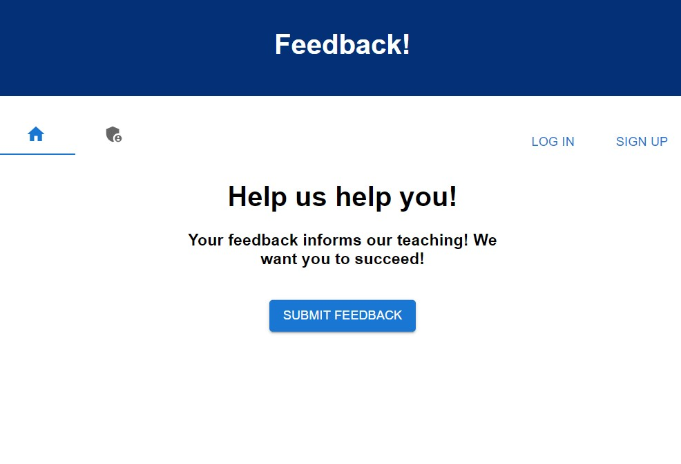
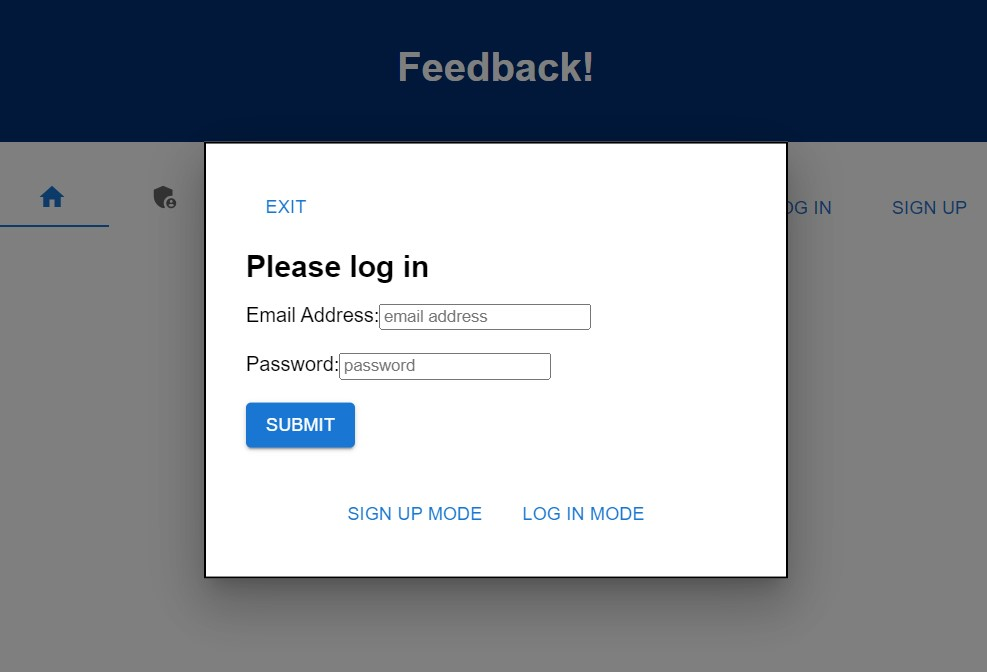
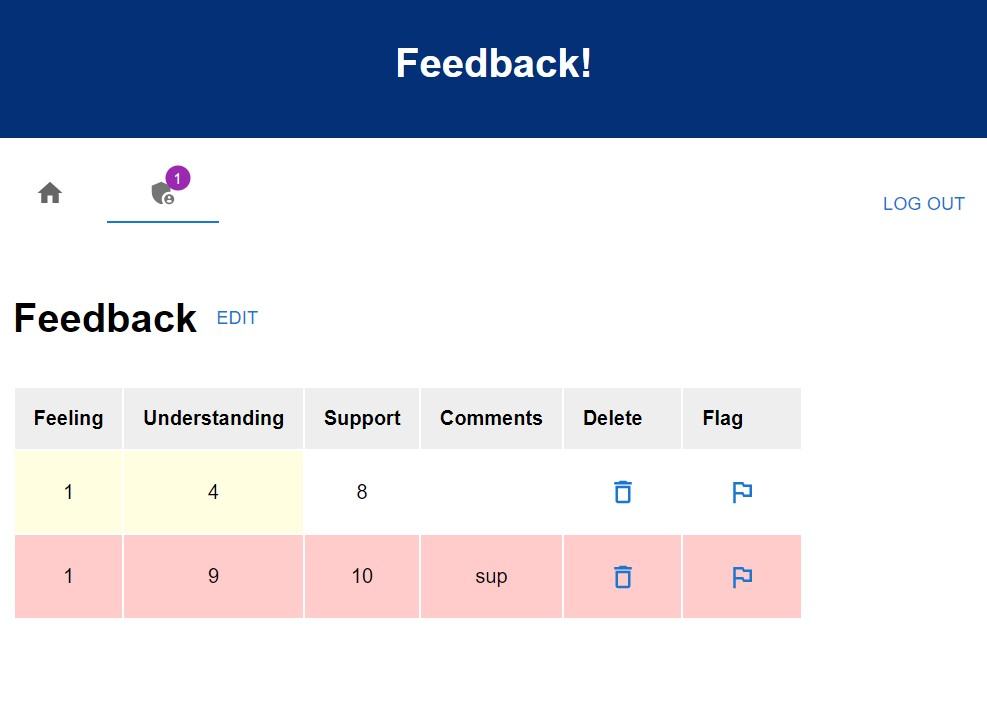

# Project Name

Feedback App

## Description
Duration: 2 Weeks

This app collects user feedback and allows an admin to view the feedback.

## Prerequisites

Features:
admin mode
    edit mode with ability to flag or delete feedback
    notification badge for flagged feedback

user mode
    enter feedback, go back in the feedback to edit
    list of feedback a given user has entered

    
    
    

## Installation

Create a database named 'prime_feedback',
The queries in the database.sql file are set up to create all the necessary tables and populate the needed data to allow the application to run correctly. The project is built on pgadmin4.
Open up your editor of choice and run an npm install
Run npm run server in your terminal
Run npm run client in your terminal, which will open up a new browser tab with the app.

## Usage

## Built With

## Acknowledgment
Thanks to Prime Digital Academy who equipped and helped me to make this application a reality.

